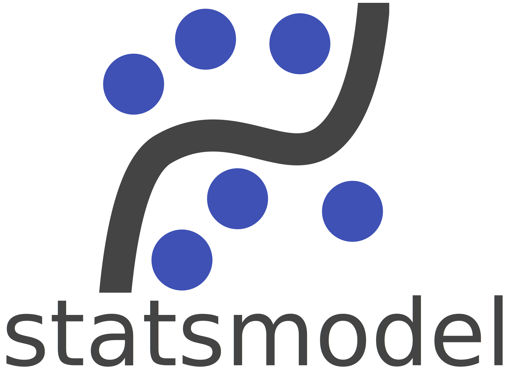
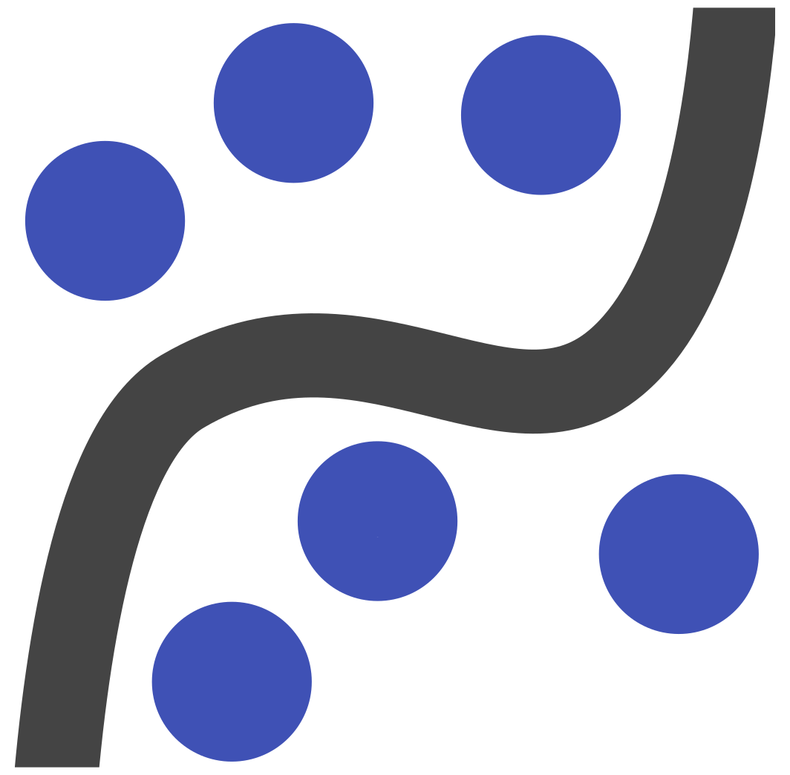
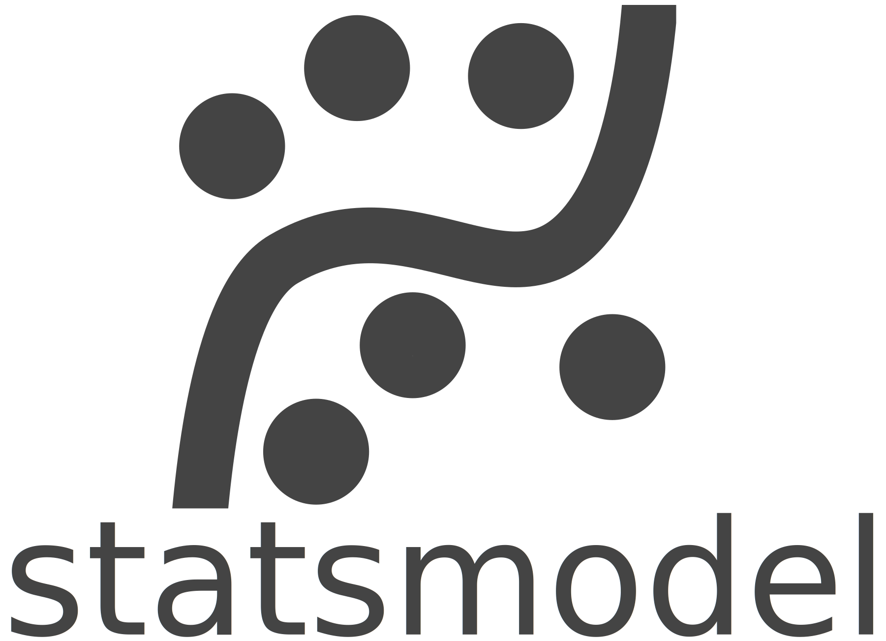
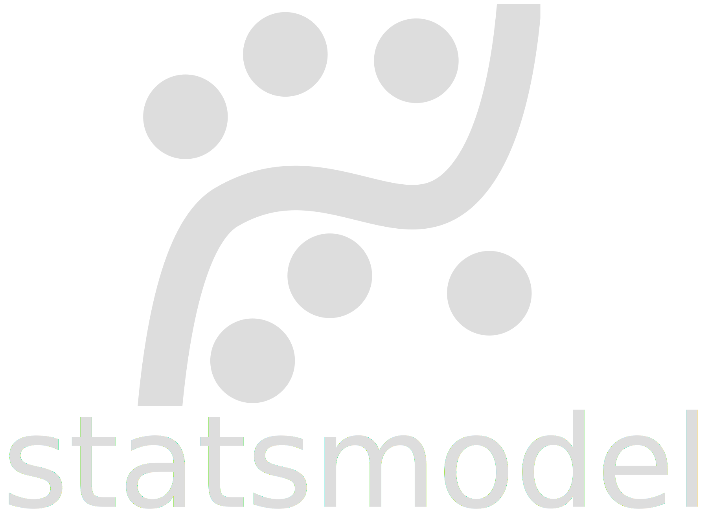

.. module:: statsmodels
   :synopsis: Statistical analysis in Python

.. currentmodule:: statsmodels

*****************
About statsmodels
*****************

Background
----------

The ``models`` module of ``scipy.stats`` was originally written by Jonathan
Taylor. For some time it was part of scipy but was later removed. During
the Google Summer of Code 2009, ``statsmodels`` was corrected, tested,
improved and released as a new package. Since then, the statsmodels
development team has continued to add new models, plotting tools, and
statistical methods.

Testing
-------

Most results have been verified with at least one other statistical package:
R, Stata or SAS. The guiding principle for the initial rewrite and for
continued development is that all numbers have to be verified. Some
statistical methods are tested with Monte Carlo studies. While we strive to
follow this test-driven approach, there is no guarantee that the code is
bug-free and always works. Some auxiliary function are still insufficiently
tested, some edge cases might not be correctly taken into account, and the
possibility of numerical problems is inherent to many of the statistical
models. We especially appreciate any help and reports for these kind of
problems so we can keep improving the existing models.

Code Stability
^^^^^^^^^^^^^^

The existing models are mostly settled in their user interface and we do not
expect many large changes going forward. For the existing code, although
there is no guarantee yet on API stability, we have long deprecation periods
in all but very special cases, and we try to keep changes that require
adjustments by existing users to a minimal level. For newer models we might
adjust the user interface as we gain more experience and obtain feedback.
These changes will always be noted in our release notes available in the
documentation.

Reporting Bugs
^^^^^^^^^^^^^^
If you encounter a bug or an unexpected behavior, please report it on
`the issue tracker <https://github.com/statsmodels/statsmodels/issues>`_.
Use the ``show_versions`` command to list the installed versions of
statsmodels and its dependencies.

.. autosummary::
   :toctree: generated/

   ~statsmodels.tools.print_version.show_versions

Financial Support
-----------------

We are grateful for the financial support that we obtained for the
development of statsmodels:

* Google `www.google.com <https://www.google.com/>`_ : Google Summer of Code
  (GSOC) 2009-2017.
* AQR `www.aqr.com <https://www.aqr.com/>`_ : financial sponsor for the work on
  Vector Autoregressive Models (VAR) by Wes McKinney

We would also like to thank our hosting providers, `github
<https://github.com/>`_ for the public code repository, `github.io
<https://www.statsmodels.org/stable/index.html>`_ for hosting our documentation
and `python.org <https://www.python.org/>`_ for making our downloads available
on PyPi.

We also thank our continuous integration providers,
`Travis CI <https://travis-ci.org/>`_ and `AppVeyor <https://ci.appveyor.com>`_ for
unit testing, and `Codecov <https://codecov.io>`_ and `Coveralls <https://coveralls.io>`_ for
code coverage.

Brand Marks
-----------

Please make use of the statsmodels logos when preparing demonstrations involving
statsmodels code.

Color
^^^^^

+----------------+---------------------+
| Horizontal     | |color-horizontal|  |
+----------------+---------------------+
| Vertical       | |color-vertical|    |
+----------------+---------------------+
| Logo Only      | |color-notext|      |
+----------------+---------------------+

Monochrome (Dark)
^^^^^^^^^^^^^^^^^

+----------------+---------------------+
| Horizontal     | |dark-horizontal|   |
+----------------+---------------------+
| Vertical       | |dark-vertical|     |
+----------------+---------------------+
| Logo Only      | |dark-notext|       |
+----------------+---------------------+

Monochrome (Light)
^^^^^^^^^^^^^^^^^^

.. note::

   The light brand marks are light grey on transparent, and so are difficult to see on this
   page. They are intended for use on a dark background.

+----------------+---------------------+
| Horizontal     | |light-horizontal|  |
+----------------+---------------------+
| Vertical       | |light-vertical|    |
+----------------+---------------------+
| Logo Only      | |light-notext|      |
+----------------+---------------------+

.. |color-horizontal| image:: images/statsmodels-logo-v2-horizontal.svg
   :width: 50%

