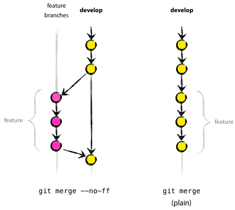

Maintainer Notes
================

This is for those with read-write access to upstream. It is recommended to name
the upstream remote something to remind you that it is read-write::

    git remote add upstream-rw git@github.com:statsmodels/statsmodels.git
    git fetch upstream-rw

Git Workflow
------------

Grabbing Changes from Others
^^^^^^^^^^^^^^^^^^^^^^^^^^^^

If you need to push changes from others, you can link to their repository by doing::

    git remote add contrib-name git://github.com/contrib-name/statsmodels.git
    get fetch contrib-name
    git branch shiny-new-feature --track contrib-name/shiny-new-feature
    git checkout shiny-new-feature

The rest of the below assumes you are on your or someone else's branch with the changes you
want to push upstream.

.. _rebasing:

Rebasing
^^^^^^^^

If there are only a few commits, you can rebase to keep a linear history::

    git fetch upstream-rw
    git rebase upstream-rw/master

Rebasing will not automatically close the pull request however, if there is one,
so do not forget to do this.

.. _merging:

Merging
^^^^^^^

If there is a long series of related commits, then you'll want to merge. You
may ask yourself, :ref:`ff-no-ff`? See below for more on this choice. Once
decided you can do::

    git fetch upstream-rw
    git merge --no-ff upstream-rw/master

Merging will automatically close the pull request on github.

Check the History
^^^^^^^^^^^^^^^^^

This is very important. Again, any and all fixes should be made locally before
pushing to the repository::

    git log --oneline --graph

This shows the history in a compact way of the current branch. This::

    git log -p upstream-rw/master..

shows the log of commits excluding those that can be reached from
upstream-rw/master, and including those that can be reached from current HEAD.
That is, those changes unique to this branch versus upstream-rw/master. See
:ref:`Pydagogue <pydagogue:git-log-dots>` for more on using dots with log and
also for using :ref:`dots with diff <pydagogue:git-diff-dots>`.

Push Your Feature Branch
^^^^^^^^^^^^^^^^^^^^^^^^

All the changes look good? You can push your feature branch after
:ref:`merging` or :ref:`rebasing` by::

    git push upstream-rw shiny-new-feature:master

Cherry-Picking
^^^^^^^^^^^^^^

Say you are interested in some commit in another branch, but want to leave the
other ones for now. You can do this with a cherry-pick. Use `git log --oneline`
to find the commit that you want to cherry-pick. Say you want commit `dd9ff35`
from the `shiny-new-feature` branch. You want to apply this commit to master.
You simply do::

    git checkout master
    git cherry-pick dd9ff35

And that's all. This commit is now applied as a new commit in master.

.. _ff-no-ff:

Merging: To Fast-Forward or Not To Fast-Forward
^^^^^^^^^^^^^^^^^^^^^^^^^^^^^^^^^^^^^^^^^^^^^^^

By default, `git merge` is a fast-forward merge. What does this mean, and when
do you want to avoid this?

   (source `nvie.com <http://nvie.com>`__, post `"A successful Git branching model" <http://nvie.com/posts/a-successful-git-branching-model/>`__)

The fast-forward merge does not create a merge commit. This means that the
existence of the feature branch is lost in the history. The fast-forward is the
default for Git basically because branches are cheap and, therefore, *usually*
short-lived. If on the other hand, you have a long-lived feature branch or are
following an iterative workflow on the feature branch (i.e. merge into master,
then go back to feature branch and add more commits), then it makes sense to
include only the merge in the main branch, rather than all the intermediate
commits of the feature branch, so you should use::

    git merge --no-ff

Handling Pull Requests
^^^^^^^^^^^^^^^^^^^^^^

You can apply a pull request through `fetch <https://www.kernel.org/pub/software/scm/git/docs/git-fetch.html>`__
and `merge <https://www.kernel.org/pub/software/scm/git/docs/git-merge.html>`__.
In your local copy of the main repo::

    git checkout master
    git remote add contrib-name git://github.com/contrib-name/statsmodels.git
    git fetch contrib-name
    git merge contrib-name/shiny-new-feature

Check that the merge applies cleanly and the history looks good. Edit the merge
message. Add a short explanation of what the branch did along with a
'Closes gh-XXX.' string. This will auto-close the pull request and link the
ticket and closing commit. To automatically close the issue, you can use any
of::

    gh-XXX
    GH-XXX
    #XXX

in the commit message. Any and all problems need to be taken care of locally
before doing::

    git push origin master

Releasing
---------

1. Checkout master::

    git checkout statsmodels/master

2. Clean the working tree with::

    git clean -xdf

   But you might want to do a dry-run first::

    git clean -xdfn

3. **Locally** tag the release. For a release candidate, for example::

    git tag -a v0.10.0rc1 -m "Version 0.10.0 Release Candidate 1" 7b2fb29

   or just::

    git tag -a v0.10.0rc1 -m "Version 0.10.0 Release Candidate 1"

   to use the last commit in master.

4. Checkout the tag::

    git checkout tags/v0.10.0rc1

5. Build a sdist to ensure that that the build is clean::

    python setup.py sdist --formats=gztar

   It is important that the build on the tar.gz file is the same as the tag. It must not be **dirty**

6. If on a new minor release (major.minor.micro format) start a new maintenance branch, for example::

    git checkout -b maintenance/0.10.x

   Any bug fixes and maintenance commits intended for the next micro release should be made
   against master as usual, but tagged with the milestone for the micro release it is intended
   for. Then merge into master as usual. When ready to do the backports, use the file
   ``tools/backport_pr.py`` to identify which PRs need to be backported and to apply them to the
   maintenance branch. The tag for the release should be made in the maintenance branch.

7. Upload the source distribution to PyPI::

    twine upload dist/*

   You might want to upload to test first::

    twine upload --repository-url https://test.pypi.org/legacy/ dist/*

8. Go back to the master branch, and add an empty commit::

    git checkout statsmodels/master
    git commit --allow-empty -m "Start of 0.11.0 development"
    git tag -a v0.11.0.dev0 -m "Start of 0.11.0 development"

9. Push everything to statsmodels::

    git push --tags

   If a new branch was created::

    git push --set-upstream origin maintenance/0.10.x

10. Make an announcement, and inform maintainers of wheel builders.

11. Profit?

Releasing from Maintenance Branch
---------------------------------

Once any patches have been backported to a maintenance branch, the release steps are

1. Checkout the branch::

    git checkout maintenance/0.10.x

2. Clean up thoroughly::

    git clean -xdf

3. **Locally** tag the release::

    git tag -a v0.10.0 -m "Version 0.10.0"

4. Checkout the tag::

    git checkout tags/v0.10.0

5. Build a sdist to ensure that that the build is clean::

    python setup.py sdist --formats=gztar

   It is important that the build on the tar.gz file is the same as the tag. It must not be **dirty**.

6. Upload the source distribution to PyPI ot PyPI test::

    twine upload dist/*

   or::

    twine upload --repository-url https://test.pypi.org/legacy/ dist/*

7. Push the tag to statsmodels::

    git push --tags

8. Make an announcement, and inform maintainers of wheel builders.

Commit Comments
---------------
Prefix commit messages in the master branch of the main shared repository with
the following::

    ENH: Feature implementation
    BUG: Bug fix
    STY: Coding style changes (indenting, braces, code cleanup)
    DOC: Sphinx documentation, docstring, or comment changes
    CMP: Compiled code issues, regenerating C code with Cython, etc.
    REL: Release related commit
    TST: Change to a test, adding a test. Only used if not directly related to a bug.
    REF: Refactoring changes
