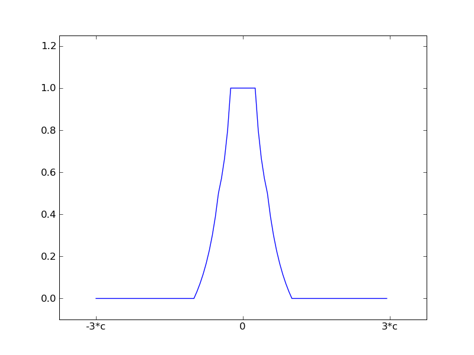
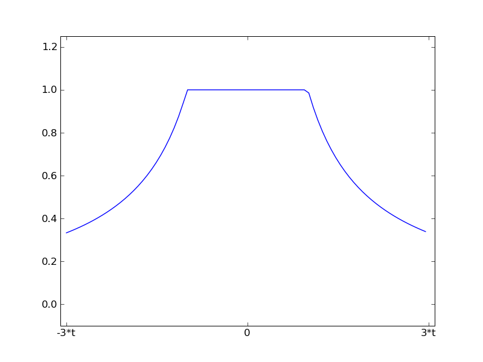
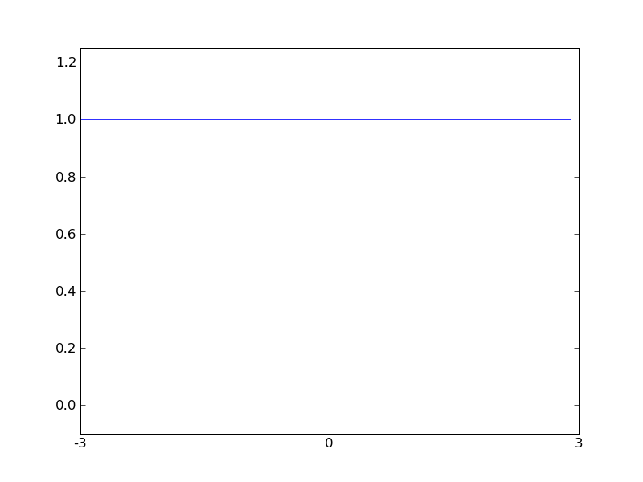
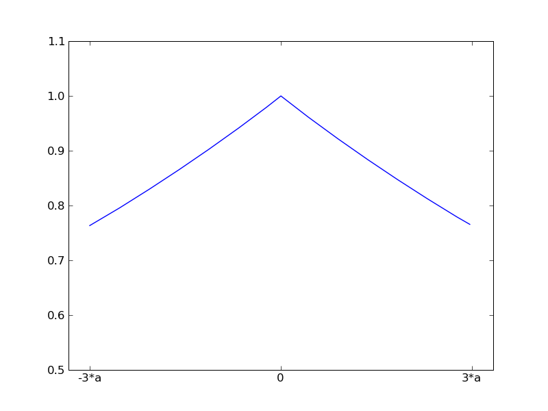
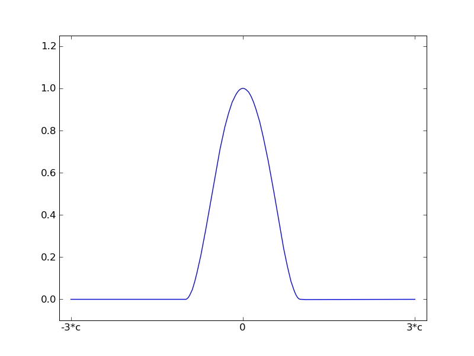

.. currentmodule:: statsmodels.rlm

.. _rlm_techn1:

Weight Functions
----------------

Andrew's Wave

.. image:: images/aw.png

Hampel 17A

Huber's t

Least Squares

Ramsay's Ea

Trimmed Mean

.. image:: images/tm.png

Tukey's Biweight

