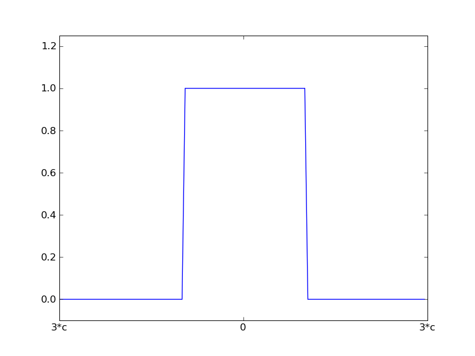

.. currentmodule:: statsmodels.rlm

.. _rlm_techn1:

Weight Functions
----------------

Andrew's Wave

.. image:: images/aw.png

Hampel 17A

Huber's t

.. image:: images/ht.png

Least Squares

Ramsay's Ea

Trimmed Mean

Tukey's Biweight

.. image:: images/tk.png

