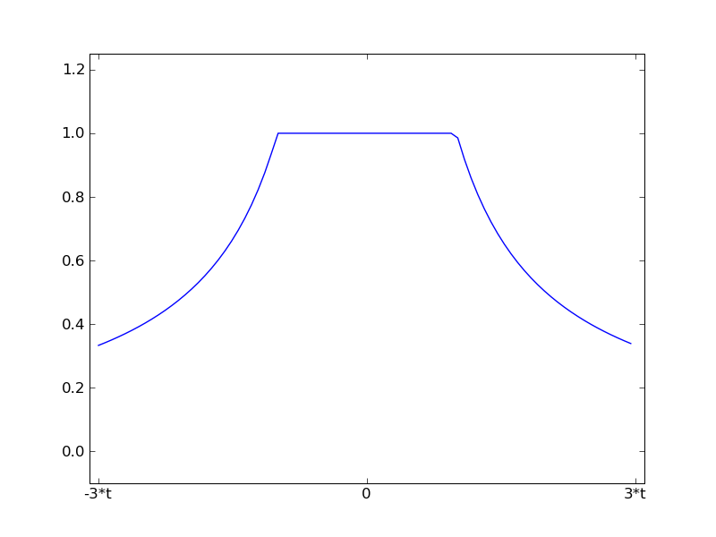
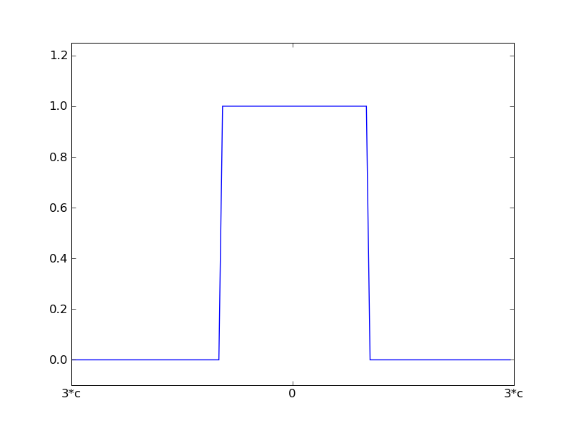

.. currentmodule:: scikits.statsmodels.rlm

.. _rlm:

Robust Linear Models
====================

Introduction
------------

.. automodule:: scikits.statsmodels.rlm

Examples
--------

::

    import scikits.statsmodels as sm
    date = sm.datasets.stackloss.Load()
    data.exog = sm.add_constant(data.exog)
    rlm_model = models.RLM(data.endog, data.exog, M=models.robust.norms.HuberT())
    rlm_results = rlm_model.fit()
    print rlm_results.params

Weight Functions
----------------

Andrew's Wave

.. image:: images/aw.png

Hampel 17A

.. image:: images/hl.png

Huber's t

Least Squares

.. image:: images/ls.png

Ramsay's Ea

.. image:: images/re.png

Trimmed Mean

Tukey's Biweight

.. image:: images/tk.png

Model and Result Classes
^^^^^^^^^^^^^^^^^^^^^^^^

.. autosummary::
   :toctree: generated/

   RLM
   RLMResults

.. _norms:

Norms
^^^^^

.. currentmodule:: scikits.statsmodels.robust.norms

.. autosummary::
   :toctree: generated/

   AndrewWave
   Hampel
   HuberT
   LeastSquares
   RamsayE
   RobustNorm
   TrimmedMean
   TukeyBiweight
   estimate_location

.. currentmodule:: scikits.statsmodels.robust.scale

Scale
^^^^^

.. autosummary::
   :toctree: generated/

    Gaussian
    Huber
    HuberScale
    mad
    huber
    hubers_scale
    stand_mad

Technical Documentation
-----------------------

.. toctree::
   :maxdepth: 1

   glm_techn1
